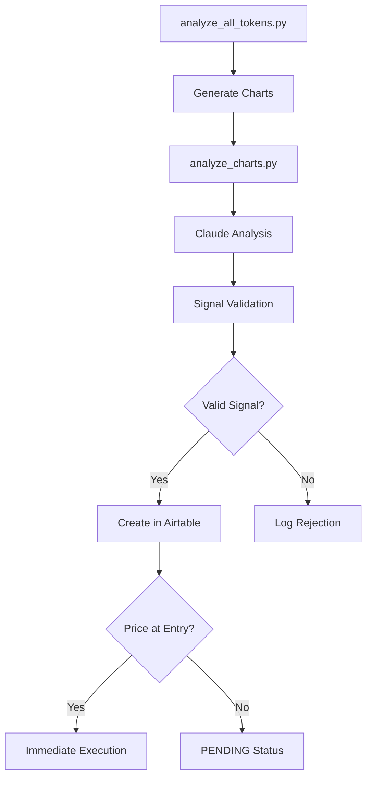
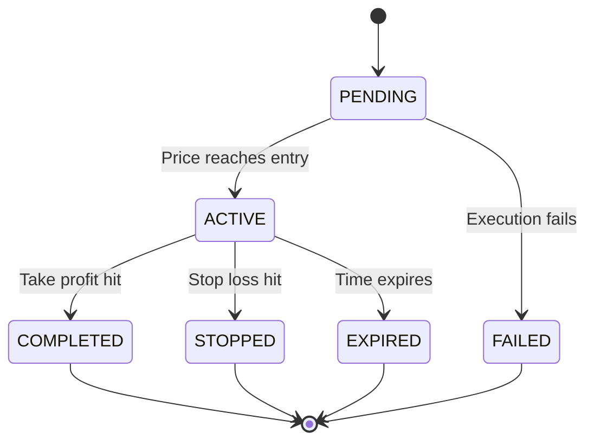
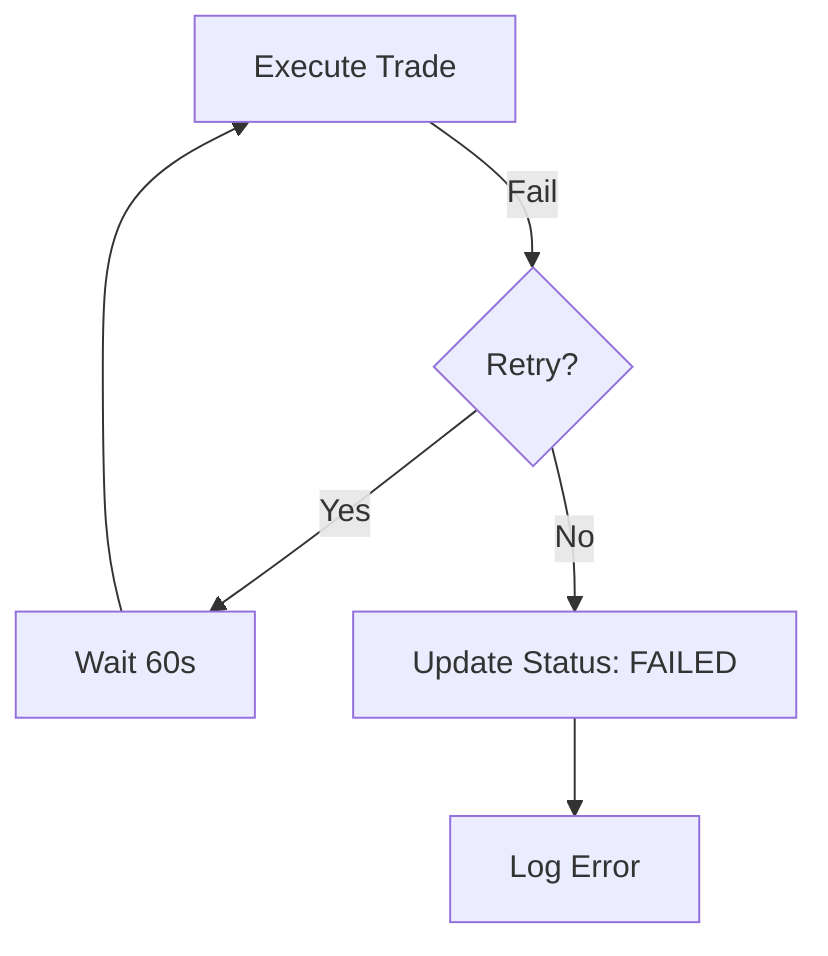

# KinKong Technical Flows Documentation

## Trade Lifecycle Overview

### 1. Signal Generation Flow


### 2. Trade Execution Paths

#### A. Immediate Execution Path
1. `analyze_charts.py`
   - Validates signal
   - Checks current price
   - If price at entry (±1%):
     ```python
     create_airtable_signal()
       → calculate_position_size()
       → execute_trade_with_phantom()
       → update_signal_status('ACTIVE')
     ```

#### B. Pending Signal Activation Path
1. `manage_signals.py::check_pending_signals()`
   - Runs every minute
   - Checks all PENDING signals
   - For each signal:
     ```python
     get_token_price()
     if price_at_entry():
         activate_signal()
           → calculate_position_size()
           → execute_trade_with_phantom()
           → update_signal_status('ACTIVE')
     ```

### 3. Active Trade Management

#### A. Regular Monitoring (`monitor_trades.py`)
Runs continuously with 60-second intervals:
```python
while True:
    monitor_active_trades()
        → get_token_price()
        → update_unrealized_pnl()
        → check_exit_conditions()
        → execute_exits_if_needed()
    sleep(60)
```

#### B. Exit Conditions
1. Take Profit Hit:
   ```python
   if current_price >= target_price:
       execute_trade_with_phantom()
       update_signal_status('COMPLETED')
   ```

2. Stop Loss Hit:
   ```python
   if current_price <= stop_loss:
       execute_trade_with_phantom()
       update_signal_status('STOPPED')
   ```

3. Time Expiry:
   ```python
   if current_time >= expiry_date:
       execute_trade_with_phantom()
       update_signal_status('EXPIRED')
   ```

### 4. Trade Status Flow


## Detailed Script Functions

### 1. `analyze_all_tokens.py`
- Entry point for analysis
- Generates charts for all timeframes
- Calls Claude for analysis
- Validates and creates signals

```python
main()
    → get_active_tokens()
    → for each token:
        → analyze_token()
            → generate_charts()
            → analyze_charts_with_claude()
            → generate_signal()
```

### 2. `analyze_charts.py`
- Handles chart analysis
- Signal validation
- Initial trade creation

```python
analyze_charts_with_claude()
    → get_market_data()
    → prepare_charts()
    → get_claude_analysis()
    → return analyses

create_airtable_signal()
    → validate_signal()
    → calculate_position_size()
    → create_record()
    → check_immediate_execution()
```

### 3. `manage_signals.py`
- Manages signal lifecycle
- Handles activation and updates

```python
check_signal_conditions()
    → check_pending_signals()
    → check_active_signals()
    → update_expired_signals()

activate_signal()
    → calculate_position_size()
    → execute_trade()
    → update_status()
```

### 4. `monitor_trades.py`
- Continuous trade monitoring
- Exit execution
- P&L tracking

```python
monitor_active_trades()
    → get_active_trades()
    → for each trade:
        → check_price()
        → update_pnl()
        → check_exits()
        → execute_if_needed()
```

### 5. `execute_trade.py`
- Handles trade execution
- Interfaces with Phantom wallet

```python
execute_trade_with_phantom()
    → get_trade_details()
    → prepare_transaction()
    → execute_via_jupiter()
    → update_records()
```

## Error Handling and Recovery

### 1. Failed Trade Execution


### 2. Price Feed Issues
- Fallback to secondary price sources
- Skip update if no reliable price
- Continue monitoring next cycle

### 3. Network Issues
- Automatic retry with exponential backoff
- Log failures for manual review
- Maintain last known good state

## Monitoring and Logging

### 1. Trade Status Updates
- Every status change logged to `SIGNAL_STATUS_HISTORY`
- Includes timestamp, reason, price

### 2. Performance Tracking
- P&L calculations updated every minute
- ROI tracking including costs
- Trade execution quality metrics

### 3. System Health
- Script uptime monitoring
- Error rate tracking
- API call success rates

## Configuration Parameters

### 1. Time Windows
- Signal expiry times by type:
  * SCALP: 6 hours
  * INTRADAY: 24 hours
  * SWING: 7 days
  * POSITION: 30 days

### 2. Price Thresholds
- Entry price threshold: ±1%
- Slippage tolerance: 1%
- Minimum price movement: 0.1%

### 3. Position Sizing
- Maximum risk per trade: 2%
- Maximum position size: 20% of portfolio
- Minimum trade size: $10

## Database Schema

### 1. SIGNALS Table
```sql
- id: string
- timestamp: datetime
- token: string
- type: BUY/SELL
- timeframe: string
- entryPrice: number
- targetPrice: number
- stopLoss: number
- status: string
- confidence: LOW/MEDIUM/HIGH
- reason: string
- expiryDate: datetime
- lastUpdateTime: datetime
```

### 2. TRADES Table
```sql
- signalId: string
- timestamp: datetime
- token: string
- type: BUY/SELL
- amount: number
- price: number
- value: number
- signature: string
- executionPrice: number
- executionTimestamp: datetime
- transactionSignature: string
- unrealizedPnl: number
- realizedPnl: number
- roi: number
```
